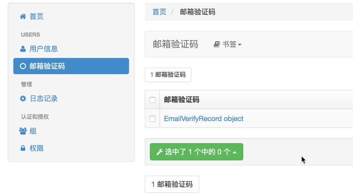
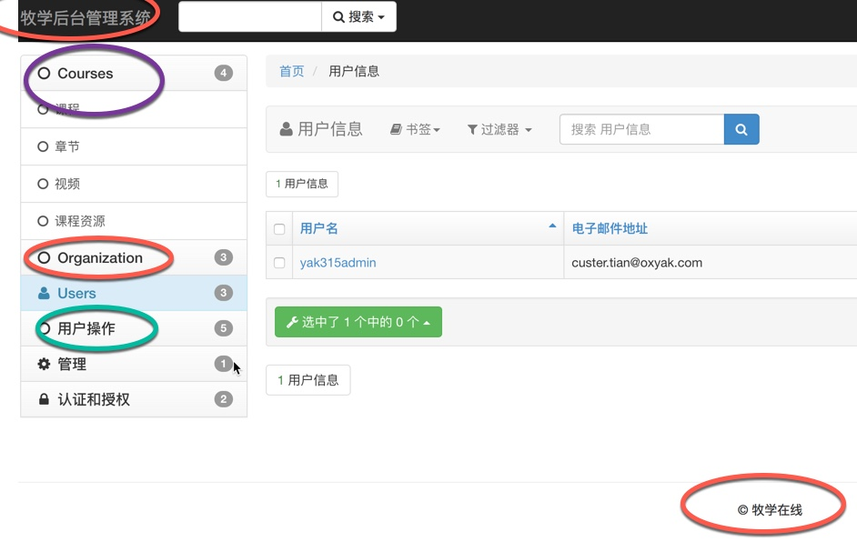

特点
--

权限管理

少前端样式

快速开发

python manage.py createsupperuser

Username: yak315admin

Email address: custer.tian@oxyak.com

Password: YaK2016!

xadmin
------

```python

INSTALLED_APPS = [
    'django.contrib.admin',
    'django.contrib.auth',
    'django.contrib.contenttypes',
    'django.contrib.sessions',
    'django.contrib.messages',
    'django.contrib.staticfiles',
    'message',
    'users',
    'courses',
    'organization',
    'operation',
    'xadmin',
    'crispy_forms',
]
```

```python
'xadmin',
'crispy_forms',
```

urls.py

```python
from django.conf.urls import url
from django.contrib import admin
from message.views import getform
import xadmin

urlpatterns = [
    # url(r'^admin/', admin.site.urls),
    url(r'^xadmin/', xadmin.site.urls),
    url(r'^form/$', getform),
]
```

源码安装
----

<https://github.com/sshwsfc/xadmin>

<https://github.com/sshwsfc/xadmin/blob/master/requirements.txt>

django~=1.9.0
django-crispy-forms~=1.6.0
django-reversion~=2.0.0
django-formtools==1.0
future==0.15.2
httplib2==0.9.2
six==1.10.0

Django 1.9 python2.7 

xadmin更新了文档现在要添加两个包

```python
pip install future
pip install six
```

xadmin的使用
---------

xadmin是基于django admin 开发的

### 1、model注册

新建adminx.py文件

```python
# -*- coding: utf-8 -*-
import xadmin

from .models import EmailVerifyRecord


class EmailVerifyRecordAdmin(object):
    list_display = ['code', 'email', 'send_type', 'send_time']#默认显示列
    search_fields = ['code', 'email', 'send_type']#搜索
    list_filter = ['code', 'email', 'send_type', 'send_time']#过滤器

xadmin.site.register(EmailVerifyRecord, EmailVerifyRecordAdmin)# model admin关联注册 
```



```python
class EmailVerifyRecord(models.Model):
    code = models.CharField(max_length=20, verbose_name=u"验证码")
    email = models.EmailField(max_length=50, verbose_name=u"邮箱")
    send_type = models.CharField(choices=(("register", u"注册"), ("forget", u"找回密码")), max_length=10, verbose_name=u"验证码类型")
    send_time = models.DateTimeField(default=datetime.now, verbose_name=u"发送时间")
    # datetime.now()不去括号是编译的时间，去括号是class实例化的时候

    class Meta:
        verbose_name = u"邮箱验证码"
        verbose_name_plural = verbose_name

    def __unicode__(self):
        return '{0}({1})'.format(self.code, self.email)
```

重载了unicode方法，返回第一个参数code第二个参数email，把这两个参数作为字符串进行连接

外键 — name字段

```python

class LessonAdmin(object):
    list_display = ['course', 'name', 'add_time']
    search_fields = ['course', 'name']
    list_filter = ['course__name', 'name', 'add_time']

xadmin.site.register(Lesson, LessonAdmin)

```

xadmin 全局配置
-----------

主题功能

```python
from xadmin import views # 主题设置 
class BaseSetting(object):
    enable_themes = True
    use_bootswatch = True
    
xadmin.site.register(views.BaseAdminView, BaseSetting)

class GlobalSettings(object):
    site_title = "牧学后台管理系统"
    site_footer = "牧学在线"
    menu_style = "accordion"    # 左侧导航栏的样式 

xadmin.site.register(views.CommAdminView, GlobalSettings)
```

在apps 里面每一个app的apps.py添加一行代码：

```python
verbose_name = u"用户操作"
```

```python
# -*- coding: utf-8 -*-
from __future__ import unicode_literals

from django.apps import AppConfig


class OperationConfig(AppConfig):
    name = 'operation'
    verbose_name = u"用户操作"
```

然后在\_\_init.py\_\_文件中添加一行代码

```python
default_app_config = "operation.apps.OperationConfig"
```

